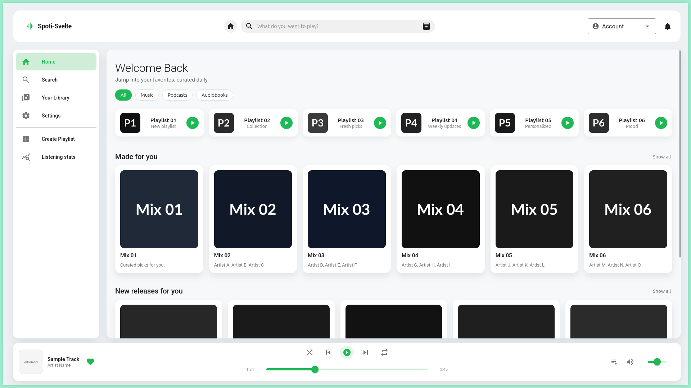

# penpot-mcp-experiments 
> [!note]
> I used Anthropics Opus 4.5 (version 06/01/2026) within the VSCode integrated copilot chat.
  
This exemplary Svelte app was used to test the capabilities of Penpot-MCPS regarding the recreational aspect of existing apps.



## Prompt Template

```md
# AGENTS.md                      

## MANDATORY
Create a `{{Profile Settings card}}` in my current penpot file, using the official penpot-mcp-tool server

Furthermore
- Use 'Flex Layout'                      
- Convert the {{sidebar}} into a component and logically group the layers:

## PENPOT-MCP-TOOL SERVER INFORMATION
"Available Tools: [{"name": "tool_execute_code_post", "description": "Executes JavaScript code in the Penpot plugin context.\nIMPORTANT: Before using this tool, make sure you have read the 'Penpot High-Level Overview' and know which Penpot API functionality is necessary and how to use it.\nYou have access two main objects: `penpot` (the Penpot API, of type `Penpot`), `penpotUtils`, and `storage`.\n`storage` is an object in which arbitrary data can be stored, simply by adding a new attribute; stored attributes can be referenced in future calls to this tool, so any intermediate results that could come in handy later should be stored in `storage` instead of just a fleeting variable; you can also store functions and thus build up a library).\nThink of the code being executed as the body of a function: The tool call returns whatever you return in the applicable `return` statement, if any.\nIf an exception occurs, the exception's message will be returned to you.\nAny output that you generate via the `console` object will be returned to you separately; so you may use itto track what your code is doing, but you should *only* do so only if there is an ACTUAL NEED for this! VERY IMPORTANT: Don't use logging prematurely! NEVER log the data you are returning, as you will otherwise receive it twice!\nVERY IMPORTANT: In general, try a simple approach first, and only if it fails, try more complex code that involves handling different cases (in particular error cases) and that applies logging.", "parameters": {"type": "object", "properties": {"code": {"type": "string", "title": "Code", "description": "The JavaScript code to execute in the plugin context."}}, "required": ["code"]}}, {"name": "tool_high_level_overview_post", "description": "Returns basic high-level instructions on the usage of Penpot-related tools and the Penpot API. If you have already read the 'Penpot High-Level Overview', you must not call this tool.", "parameters": {"type": "object", "properties": {}, "required": []}}, {"name": "tool_penpot_api_info_post", "description": "Retrieves Penpot API documentation for types and their members.Be sure to read the 'Penpot High-Level Overview' first.", "parameters": {"type": "object", "properties": {"type": {"type": "string", "title": "Type", "description": ""}, "member": {"type": "string", "title": "Member", "description": ""}}, "required": ["type"]}}, {"name": "tool_export_shape_post", "description": "Exports a shape from the Penpot design to a PNG or SVG image, such that you can get an impression of what the shape looks like.\nAlternatively, you can save it to a file.", "parameters": {"type": "object", "properties": {"shapeId": {"type": "string", "title": "Shapeid", "description": "Identifier of the shape to export. Use the special identifier 'selection' to export the first shape currently selected by the user."}, "format": {"type": "string", "title": "Format", "description": "The output format, either PNG (default) or SVG.", "default": "png"}, "filePath": {"type": "string", "title": "Filepath", "description": "Optional file path to save the exported image to. If not provided, the image data is returned directly for you to see."}}, "required": ["shapeId"]}}, {"name": "tool_import_image_post", "description": "Imports a pixel image from the local file system into Penpot by creating a Rectangle instance that uses the image as a fill. The rectangle has the image's original proportions by default. Optionally accepts position (x, y) and dimensions (width, height) parameters. If only one dimension is provided, the other is calculated to maintain the image's aspect ratio. Supported formats: JPEG, PNG, GIF, WEBP.", "parameters": {"type": "object", "properties": {"filePath": {"type": "string", "title": "Filepath", "description": "Absolute path to the image file to import."}, "x": {"type": "number", "title": "X", "description": "Optional X coordinate for the rectangle's position."}, "y": {"type": "number", "title": "Y", "description": "Optional Y coordinate for the rectangle's position."}, "width": {"type": "number", "title": "Width", "description": "Optional width for the rectangle. If only width is provided, height is calculated to maintain aspect ratio."}, "height": {"type": "number", "title": "Height", "description": "Optional height for the rectangle. If only height is provided, width is calculated to maintain aspect ratio."}}, "required": ["filePath"]}}]                      
                      
Your task is to choose and return the correct tool(s) from the list of available tools based on the query. Follow these guidelines:                      
                      
- Return only the JSON object, without any additional text or explanation.                      
                      
- If no tools match the query, return an empty array:                      
   {                      
     "tool_calls": []                      
   }                      
                      
- If one or more tools match the query, construct a JSON response containing a "tool_calls" array with objects that include:                      
   - "name": The tool's name.                      
   - "parameters": A dictionary of required parameters and their corresponding values.                      
                      
The format for the JSON response is strictly:                      
{                      
  "tool_calls": [                      
    {"name": "toolName1", "parameters": {"key1": "value1"}},                      
    {"name": "toolName2", "parameters": {"key2": "value2"}}                      
  ]                      
}" 
```
*The prompt I used for my experiments. I also added a screenshot and the specific Svelte page file. For example, for the sidebar, I added the [screenshot](https://github.com/soon2moon/penpot-mcp-examples/blob/main/images/sidebar.png) and [svelte file](https://github.com/soon2moon/penpot-mcp-examples/blob/main/src/lib/components/Sidebar.svelte).*


The Opus-4.5 capability to create PenPot designs is incredible. I added the prompt the I used for the sake of completeness, but it didn't make much difference. The only things that actually make a difference are saying 'use flex layout' and 'logically grouping the layers together'. 

I noticed that if the layers were not included in the component initially, the model would not be able to correct this afterwards due to the way PenPot components work (see [Main component cannot be detached from itself... Make sure that you are trying to detach a component copy...](https://community.penpot.app/t/penpot-2-0-broke-all-of-our-designs/5080/2#:~:text=flow%2E-,Main,it)). 

For example, if a drop-down menu with a label and an icon were not created as a component from the start, the model would not be able to add them afterwards. You would either need to delete the component and try again, or prompt to create a copy and modify that copy instead (in this case, Opus deleted and recreated the component automatically). To resolve this issue, it's important to add the part 'logically group the layers together'.


## start the svelte app and open the site in the browser

```sh
npm run dev -- --open
```

## Examples


